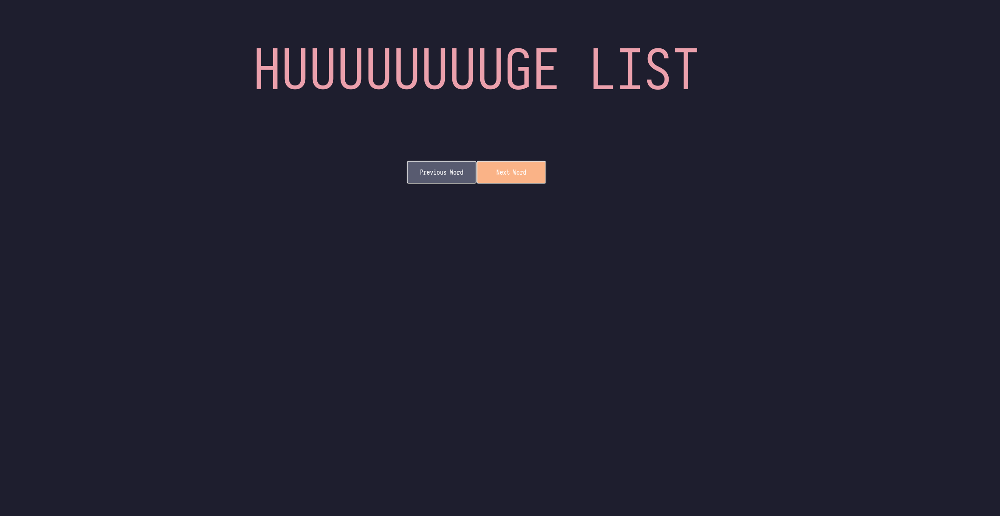

# A Yew Rust Web App

Nothing fancy. It simply displays words from a list, navigating with previous/next buttons.

The colors are pulled from [Catppuccin](https://github.com/catppuccin/catppuccin).

## TODO

- [ ] Make it pull a word randomly
- [ ] Refactor as I learn more about Rust 🦀
- [ ] Pull the words from a word list

## Screenshot

